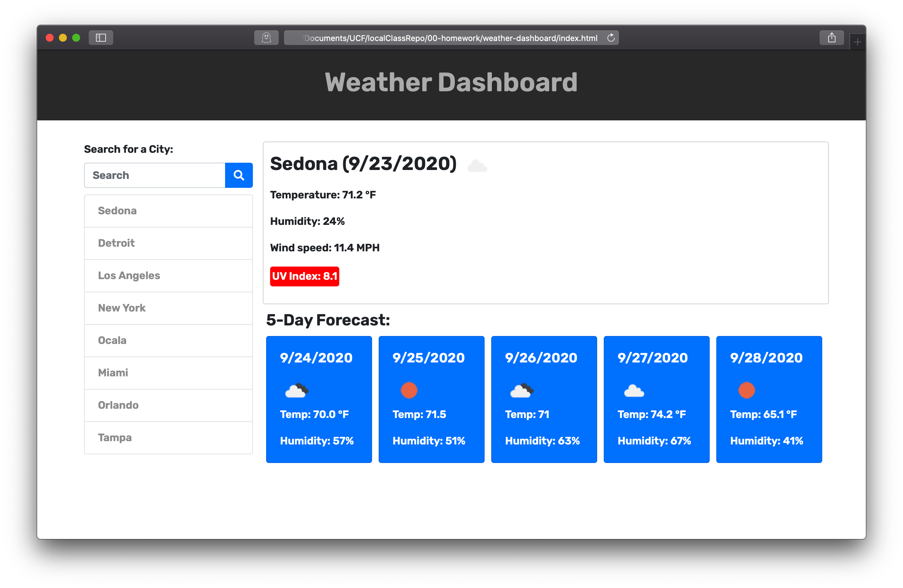

# Weather Dashboard

This is a weather dashboard application that will run in the browser and feature dynamically updated HTML and CSS. Developers are commonly asked to retrieve data from another API and use it in their own code. This application uses the [OpenWeather API](https://openweathermap.org/api) to retrieve weather data for cities. After typing in a city, this application will display the current temperature, humidity, wind speed, UV Index, and five-day forecast. The city the user entered will also be saved for when they revisit the page.

## User Story

```
AS A traveler
I WANT to see the weather outlook for multiple cities
SO THAT I can plan a trip accordingly
```

## Acceptance Criteria

```
GIVEN a weather dashboard with form inputs
WHEN I search for a city
THEN I am presented with current and future conditions for that city and that city is added to the search history
WHEN I view current weather conditions for that city
THEN I am presented with the city name, the date, an icon representation of weather conditions, the temperature, the humidity, the wind speed, and the UV index
WHEN I view the UV index
THEN I am presented with a color that indicates whether the conditions are favorable, moderate, or severe
WHEN I view future weather conditions for that city
THEN I am presented with a 5-day forecast that displays the date, an icon representation of weather conditions, the temperature, and the humidity
WHEN I click on a city in the search history
THEN I am again presented with current and future conditions for that city
WHEN I open the weather dashboard
THEN I am presented with the last searched city forecast
```

## Mock-Up

The following image shows the web application's appearance and functionality:




## Deployment

- Application: https://crowe828.github.io/weather-dashboard/
- GitHub Repo: https://github.com/Crowe828/weather-dashboard

## Built With

- HTML5
- CSS3
- Bootstrap
- Font Awesome
- JavaScript
- jQuery
- Moment.js
- OpenWeather API

## Authors

**Christian Rowe** - _Sole Contributor_ - [GitHub](https://github.com/Crowe828)

## Acknowledgments

œThis project was completed thanks to my instructor, John Wayne Dinsmore, his TA Jorge Alvarez, as well as the help from all of my fellow classmates.
